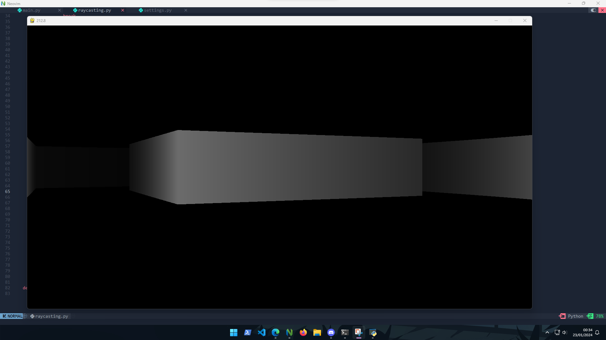
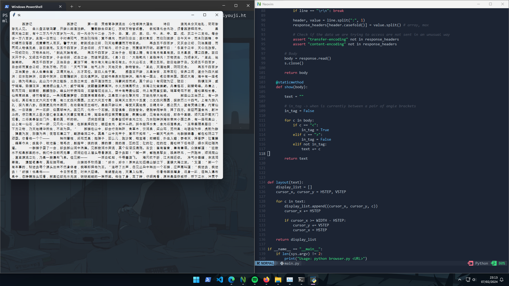

<br><br>

[](https://git.io/typing-svg)

<br>


## About me

- I'm a self-taught developer, and there's nothing quite like figuring out how things work on your own.

- My journey began when I was still very young, not even in school yet. I started learning how computers worked by reading some books I had in the home library.

- It wasn't until 2017 that I truly delved into learning the fundamentals of programming. I started coding in Java to create games. Yes, Java for making games - after all, in my mind, if Minecraft is made in Java, then Java should do the trick, right?

## Skills
```
#include <stdio.h>
#include <stdlib.h>
#include <string.h>

struct Joel
{
    char **languages;
    char *name;
    int age;
};

int main()
{
    struct Joel joel;
    joel.languages = malloc(6 * sizeof(char *));
    joel.name = strdup("Joel");
    joel.age = 19;

    const char *language_literals[] = {"Python", "C", "SQL", "JavaScript", "Java", "BASIC"};

    for (int i = 0; i < 6; i++)
    {
        joel.languages[i] = strdup(language_literals[i]);
    }

    printf("Name: %s\n", joel.name);
    printf("Age: %d\n", joel.age);
    printf("Languages:\n");
    for (int i = 0; i < 6; i++)
    {
        printf("  %s\n", joel.languages[i]);
    }

    free(joel.name);
    for (int i = 0; i < 6; i++)
    {
        free(joel.languages[i]);
    }
    free(joel.languages);

    return 0;
}
```
<div align="center">
    
<a href="https://docs.microsoft.com/en-us/cpp/?view=msvc-170" target="_blank" rel="noreferrer"></a>
<a href="https://www.oracle.com/java/" target="_blank" rel="noreferrer"></a>
<a href="https://www.python.org/" target="_blank" rel="noreferrer"></a>
<a href="https://www.typescriptlang.org/" target="_blank" rel="noreferrer"></a>
<a href="https://developer.mozilla.org/en-US/docs/Web/JavaScript" target="_blank" rel="noreferrer"></a>
<a href="https://developer.mozilla.org/en-US/docs/Glossary/HTML5" target="_blank" rel="noreferrer"></a>
<a href="https://www.w3.org/TR/CSS/#css" target="_blank" rel="noreferrer"></a>
<a href="https://www.mysql.com/" target="_blank" rel="noreferrer"></a>
    
</div>
<br>

## My Statistics

<p align=center>

  <div align=center>
    <a href="https://github.com/denvercoder1/github-readme-streak-stats" title="Go to Source">
      
    </a>
    <a href="https://github.com/anuraghazra/github-readme-stats" title="Go to Source">
      
    </a>
  </div>

  <br><br><br><br><br><br><br><br><br>

  <div align=center>
    <a href="https://github.com/joelfm4/github-readme-stats">
      
    </a>
  </div>
  <br>
  
  
</p>

<br/>

<br>
<div width="100%" align="center">
  <a align="left" href="https://github.com/Joelfm4/FireBox" title="FireBox"></a>
  <a align="right" href="https://github.com/Joelfm4/Ray-Casting" title="Ray-Casting"></a>
</div>

<br/><br/><br/><br/><br/><br/>

<h4 align="center">
  <a href="https://github.com/Joelfm4?tab=repositories" title="Show Repositories">🔎 Show More 🔍</a>
</h4>

<!--
## Ray-casting algorithm


## Brower (FireBox)


-->

